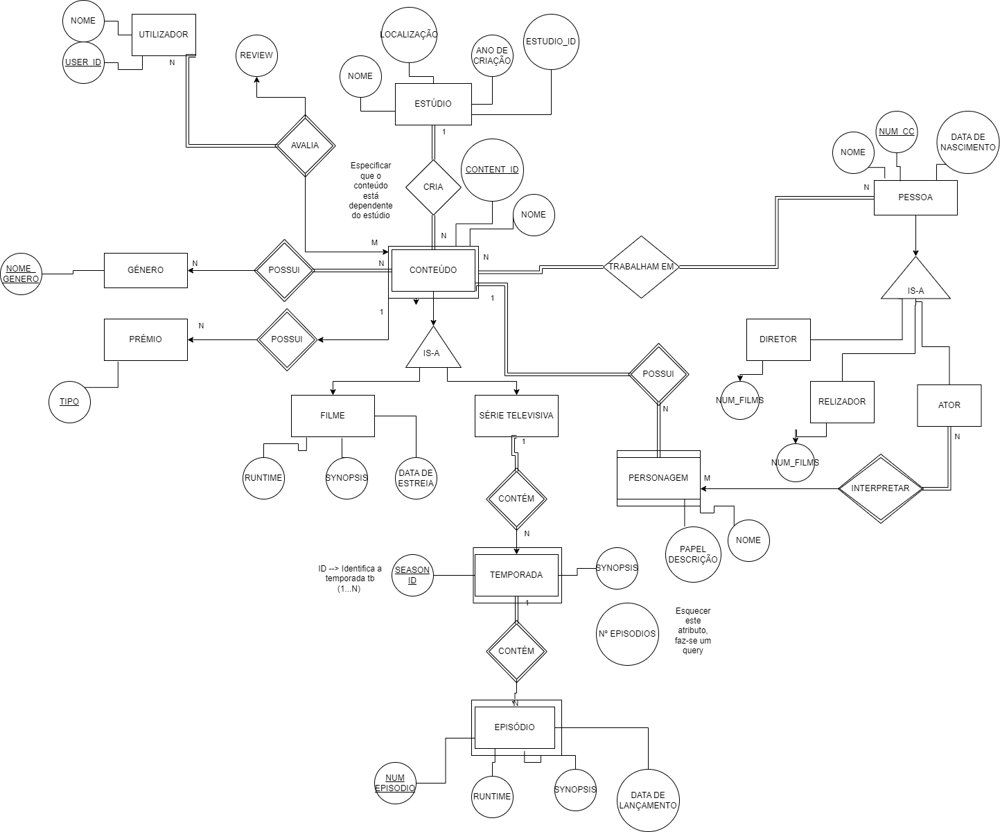
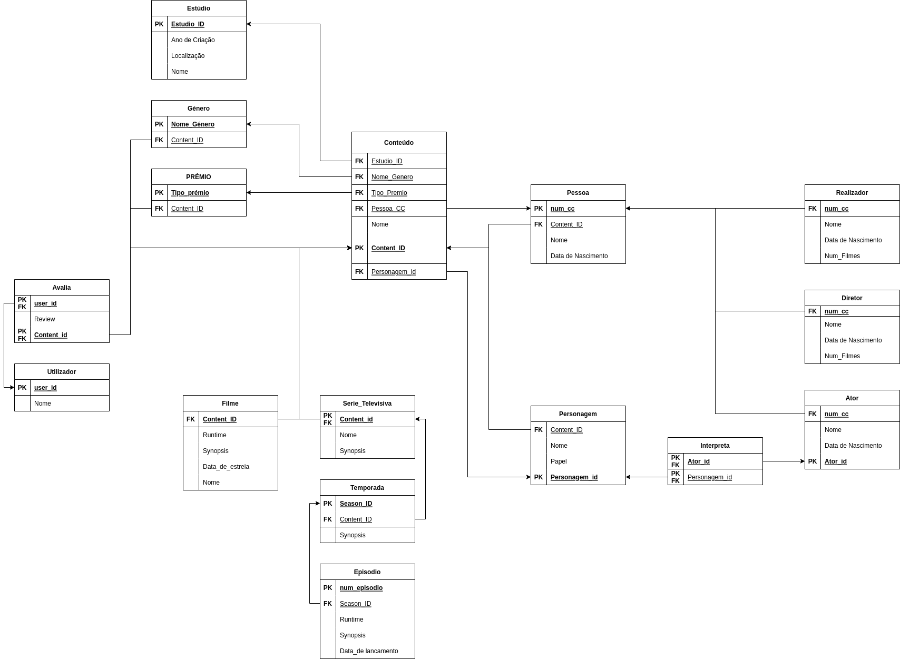

# BD: Trabalho Prático APFE

**Grupo**: P2G9
- João Figueiredo, MEC: 98506
- Tiago Mostardinha, MEC: 103944

## Introdução / Introduction
 
Base de dados para gerir filmes/séries, relacionando os ratings imdb, associar atores, realizadores, estudios, produtores, prémios (caso tenham ganho), género, etc

## ​Análise de Requisitos / Requirements
```
Database Design: Plan the structure and relationships of your database tables, including entities like movies, TV shows, actors, directors, and more.

Data Collection: Collect information about movies, TV shows, and people, such as titles, genres, release dates, actors, directors, producers, writers, ratings, and more.

Data Storage: Store information about movies, TV shows, and people in SQL Databasw

Search Functionality: Allow users to search for movies, TV shows, and people by name, genre, year, and other relevant criteria.

Administration Panel: Allow admins to manage the database, moderate reviews and ratings, and edit the database as necessary.

Data Validation: Ensure that data is valid and consistent by adding constraints and validations to the database schema.
```


## DER




## ER

