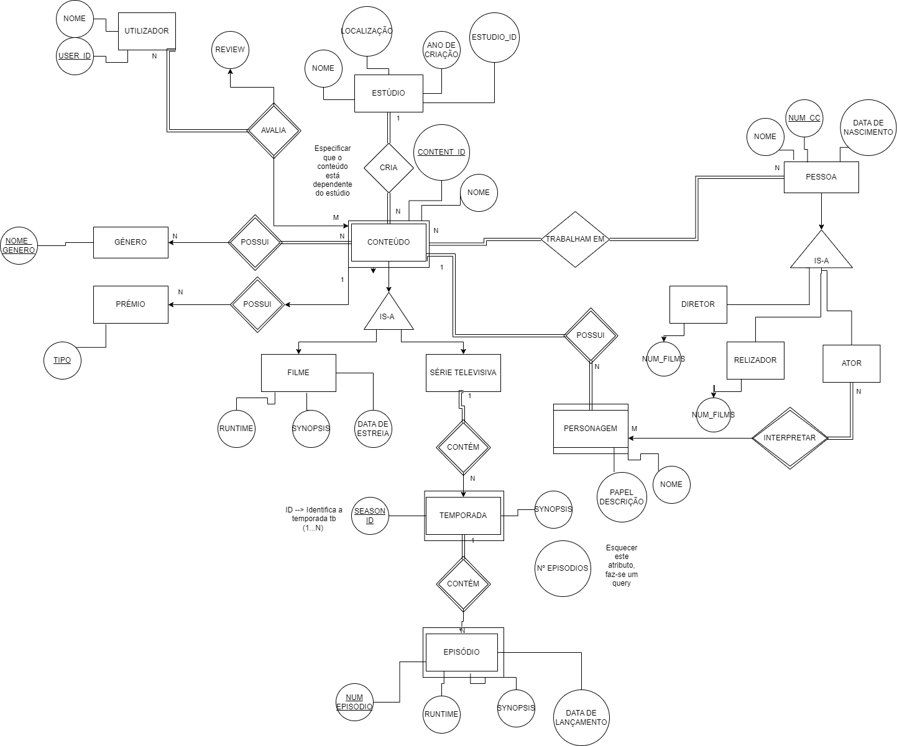
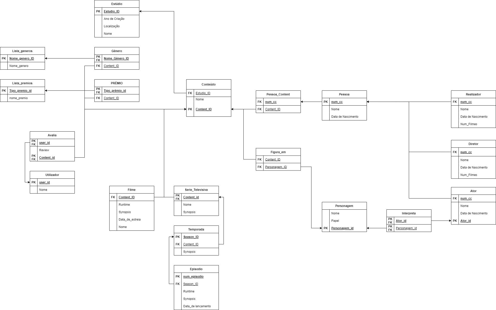

# BD: Trabalho Prático APF-T

**Grupo**: P2G9
- Tiago Mostardinha, MEC: 103944
- João Cidra, MEC: 98506


## Introdução / Introduction
 
O Gestor multimédia é uma base de dados projetada para gerir filmes e séries televisivas, abrangendo uma ampla variedade de informação quanto a cada tipo de conteúdo, incluindo avaliações, comentários, pesquisa personalizada e entre outras funcionalidades. Além disso, esta base de dados permite o registo de conteúdo e a gestão ou manipulação do mesmo. Este permite também associar pessoas a um conteúdo, sendo estes atores, diretores e produtores, e a estúdios que produziram esse mesmo conteúdo. Esta plataforma também permite a associação de séries televisivas às respetivas temporadas e, consequentemente, cada episódio a cada temporada. A Base de dados também suporta operações de criação, remoção e edição de conteúdo fornecendo aos utilizadores recursos para gerir a base de dados. 

---

## ​Análise de Requisitos 

Na fase inicial do processo de desenvolvimento do desenho da base de dados, será necessário fazer uma análise de requisitos. A análise de requisitos envolve uma aquisição  e compreensão de informação quanto à finalidade da base de dados. Passado o processo de brainstorming quanto às finalidades da base de dados da plataforma, Gestor Multimédia, identificámos um conjunto de necessidades e expetativas para as funcionalidades que a base de dados deveria permitir.

###  Requisitos Funcionais

Alguns dos requisitos funcionais identificados para o desenvolvimento da plataforma e base de dados, abrange desde o desenho da base de dados até à visualização, procura ou filtração, registo de dados e entre outras funcionalidades que estarão disponíveis na nossa plataforma e base de dados.

A primeira preocupação ao desenhar uma base de dados, será ter um diagrama organizado e estruturado, com as entidades e as suas relações. A compreensão da relevância de um diagrama que traduza as relações e dependência das entidades é crucial para o desenvolvimento, eficiente, de um schema para a base de dados.

Ao registar informação na plataforma é necessário que a base de dados guarde uma grande variedade de tipos de dados. Alguns dos dados que serão guardados são nomes de pessoas, filmes, o género do conteúdo, classificações, entre outros. Além disso, é necessário garantir uma integridade, escalabilidade da recolha de dados.

Um dos requisitos principais que o Gestor de Multimédia terá de tomar em consideração é um sistema de procura rápida e eficaz de conteúdo, ou seja, tanto de séries como filmes. A interface responsável pela procura poderá procurar conteúdo pelo nome do filme, do estúdio, além disso, existem outras opções para filtração, por exemplo, por género de conteúdo pessoas que participam nos filmes e também a ordenação na visualização do conteúdo.

A plataforma Gestor de Multimédia também irá precisar de uma interface onde o administrador poderá adicionar ou remover filmes, pessoas, users e entre outro tipo de entidades que a base de dados suporta. Esta interface disponibilizará ao administrador controlo total sobre todas as entidades da base de dados, onde existem um conjunto de ferramentas e funcionalidades para a gestão das mesmas.

O Gestor de Multimédia também terá de garantir a validade e consistência dos dados introduzidos, como tal é necessário, fazer restrições na schema da base de dados para garantir que os dados introduzidos são válidos, prevenindo a introdução de dados incorretos ou incompletos, garantindo a sua precisão.

### Requisitos Não Funcionais

O Gestor de Multimédia também contem um conjunto de requisitos não funcionais para garantir a desempenho e usabilidade da plataforma. Para garantir desempenho a plataforma é focada numa interface user-friendly que leva aos utilizadores a rapidamente obter a informação sobre os conteúdos. Ao abordar esses requisitos não funcionais, a base de dados do Gestor de Multimédia teve como objetivo oferecer um sistema de alto desempenho, fácil de usar e escalável.

---

## DER - Diagrama Entidade Relacionamento/Entity Relationship Diagram

### Versão final/Final version
Um Diagrama de Entidade Relação fornece uma representação visual entidades e dos seus atributos, juntamente, com  as suas relações. Com o diagrama de entidade relação temos uma visão clara do funcionamento da estrutura da base de dados. O DER do Gestor de Multimédia pode ser resumo nas seguintes relações:
-  As principais entidades no diagrama são os conteúdos, onde os filmes, as séries televisivas são especializações do conteúdo, os estúdios, os utilizadores, as personagens, as pessoas e os atores, diretores e realizadores que são especializações da entidade Pessoa.
- Alguns dos atributos presentes no diagrama incluem ids, nomes, datas de lançamento, sinopses, avaliações, localizações e,  entre outros. A principais relações do diagrama é entre o conteúdo com o estúdio, as pessoas, os géneros, os prémios, os users, e as relações de especialização de pessoas para atores, diretores e realizadores e a relação de especialização de conteúdo para filme ou série. 



### APFE 

Descreva sumariamente as melhorias sobre a primeira entrega.
Describe briefly the improvements made since the first delivery.

## ER - Esquema Relacional/Relational Schema
O Modelo Relacional é um modelo conceptual para o desenho da base de dados que representa as entidades, os atributos e as relações entre elas, juntamente com as suas dependências. Este serve como uma blueprint do schema da base de dados, orientando na criação de tabelas, chaves e as suas restrições garantindo integridade e organização dos dados.

### Versão final/Final Version



### APFE

1. no diagram ER criámos uma nova tabela list_generos, pois não se pode ter varchar como primary key, então trocámos o nome para nome_genero_id como PK que vai associar a uma tabela com o ID e a seguir uma varchar com o nome associado ao ID

2. no diagram ER criámos uma nova tabela list_premios, pois não se pode ter varchar como primary key, então trocámos o nome para premio_id como PK que vai associar a uma tabela com o ID e a seguir uma varchar com o premio associado ao ID

3.  Criámos uma tabela pessoa-conteudo e personagem-conteudo, para garantir existirem várias pessoas e personagem num conteudo


## ​SQL DDL - Data Definition Language

Após um longo período de brain-storming consciencializando quais os requisitos necessários para o Gestor de multimédia e de desenvolver o Diagrama de Entidade-Relação e o Modelo Relacional, poderemos então implementar a base de dados no SQL Server. Onde através de instruções DDL, traduizmos o nosso modelo relacional, com as suas entidades, atributos e relações diretamente no SSMS que introduz no SQL Server, posteriormente.

[SQL DDL File](sql/01_ddl.sql "SQLFileQuestion")

## SQL DML - Data Manipulation Language


### Browse Form

A nossa Form para o Browse mostra todos os conteúdos disponíveis, juntamente com parte da sua informação numa tabela. Através de consultas SQL com junções LEFT JOIN nas tabelas `conteudo`, `Filme` e `serie_televisiva`, os dados são disponibilizados. Essa abordagem permite exibir todos os atributos dos conteúdos, como nome, duração, sinopse, data de estreia e classificação.

![[browse.png]]
![[b1.jpg]]
![[b2.jpg]]

```sql
-- Filtra e procura Conteudo através do estudios, do nome e do tipo de conteudo
SELECT c.content_id, c.nome, f.runtime, f.synopsis, f.data_estreia, f.rating, s.nome AS serie_nome, s.synopsis AS serie_synopsis, s.rating AS serie_rating " +
    "FROM conteudo c " +
    "LEFT JOIN Filme f ON c.content_id = f.content_id " +
    "LEFT JOIN serie_televisiva s ON c.content_id = s.content_id
```


### Review Form

Nesta form poderemos adicionar uma review de um conteúdo, após selecionar  um filme na Browse Form irá aparecer uma nova form que será responsável pelas as review onde pedirá para realizar o login do user e o comentário que o utilizador deseja adicionar. Além disso, também ao selecionar a review há opção de visualizar o que outros utilizadores escreveram quanto a esse conteúdo.

![[review.png]]

```sql
-- Adiciona Review ao conteudo
INSERT INTO avalia (user_id, content_id, review) VALUES (@userId, @contentId, @review

-- Verifica que Reviews estão no Conteudo
SELECT utilizador.nome, avalia.review FROM avalia INNER JOIN utilizador ON avalia.user_id = utilizador.user_id WHERE avalia.content_id = @contentId
```

### Admin Form

Neste Form o admin encontra-se em controlo sobre toda a base de dados, onde poderá adicionar, editar ou remover todo o tipo de entidades, estas como, os estúdios, as temporadas, os episódios os filmes, as series televisivas, os utilizadores e entre outras.Essas funcionalidades fornecem ao administrador o poder de gerir e controlar a base de dados de forma eficiente e conveniente.

![[admin.png]]
```sql
-- Find the estudio_id for the given estudio_name
SELECT estudio_id FROM estudio WHERE nome = @estudio_name;
-- Step 2: Insert movie data into conteudo table
INSERT INTO conteudo (estudio_id, nome, content_id) VALUES (@estudio_id, @nome, @content_id);
-- Insert movie data into Filme table
INSERT INTO Filme (content_id, runtime, synopsis, data_estreia, rating) VALUES (@content_id, @runtime, @synopsis, @data_estreia, @rating);
-- Step 4: Add genres if they exist
SELECT nome_genero_id FROM lista_generos WHERE nome_genero = @nome_genero;
INSERT INTO genero (content_id, nome_genero_id) VALUES (@content_id, @nome_genero_id)
--Step 5: Add premios if they exist
SELECT nome_premio_id FROM lista_premios WHERE nome_premio = @nome_premio;
INSERT INTO premio (content_id, nome_premio_id) VALUES (@content_id, @nome_premio_id);

-- Adicionar Séries
INSERT INTO conteudo (estudio_id, nome, content_id) VALUES (@estudio_id, @nome, @content_id)
INSERT INTO serie_televisiva (content_id, nome, synopsis, rating) VALUES (@content_id, @nome, @synopsis, @rating)
SELECT nome_genero_id FROM lista_generos WHERE nome_genero = @nome_genero;
INSERT INTO genero (content_id, nome_genero_id) VALUES (@content_id, @nome_genero_id);
SELECT nome_premio_id FROM lista_premios WHERE nome_premio = @nome_premio;
NSERT INTO premio (content_id, nome_premio_id) VALUES (@content_id, @nome_premio_id);
```


## Normalização/Normalization
Durante a normalização seguimos um conjunto de princípios para normalizar a nossa base de dados, onde tivemos de reduzir na redundância ao eliminar dados ou atributos duplicados, que consequentemente garante a consistência dos dados. Ao definir as chaves  primárias apropriadamente, garante-se a integridade entre entidades.

1. A primeira normalização foi nas especializações de pessoa, realizador,director e ator , onde ambos tem o nome, a data nascimento em comum e ambas estão presentes na tabela Pessoa. Portanto, poderemos retirar o nome e a data de nascimento e podemos depender da chave estrangeira num_cc para referenciar a tabela pessoa para obter essa informação. 
2. A segunda normalização foi consoante à utilização de uma chave estrangeira e primária nas tabelas género e prémios, onde após esta alteração permite múltiplos géneros e múltiplos prémios dentro do mesmo conteúdo, pois a chave primária garante a combinações única entre o conteúdo e os prémios , utilizando o nome_premio_id, e entre o conteúdo e os géneros que partilham o nome_genero_id.

## Índices/Indexes

Este índex irá ajudar na otimização das queries que filtram ou fazem a disjunção na coluna, estudio_id na tabela do conteúdo.
```sql
CREATE INDEX idx_conteudo_estudio_id ON conteudo(estudio_id);
```
Este Index irá ajudar na otimização das queries de filtragem ou fazem a disjunção na coluna do  user_id na tabela avalia.
```sql
CREATE INDEX idx_avalia_user_id ON avalia(user_id);
```
Estes indexs irão melhorar a performance das queries que necessitam de filtrar ou agregar as colunas, anteriormente referidas.


## SQL Programming: Stored Procedures, Triggers, UDF

[SQL SPs and Functions File](sql/02_sp_functions.sql "SQLFileQuestion")

[SQL Triggers File](sql/03_triggers.sql "SQLFileQuestion")

---

## Conclusões
Em conclusão, o  Gestor Multimédia é uma base de dados projetada para gerir filmes e séries televisivas, fornecendo uma ampla gama de funcionalidades, como pesquisa personalizada, registo de conteúdo, associação de pessoas e estúdios, entre outros. A análise de requisitos identificou os requisitos funcionais e não funcionais, enquanto os diagramas ER e DER forneceram uma representação visual das entidades, atributos e relações. O esquema relacional e as consultas SQL demonstraram a implementação prática da base de dados, incluindo a manipulação de dados e a criação de índices para otimização de desempenho. As stored procedures, triggers e UDFs foram abordadas para aprimorar a funcionalidade da base de dados. Em suma, o Gestor Multimédia oferece uma solução eficiente e escalável para a gestão de conteúdo multimédia.

---


## Contribuições
- Tiago Mostardinha -> 50%
- João Cidra -> 50%


## Outras notas/Other notes

### Dados iniciais da dabase de dados/Database init data

[Indexes File](sql/01_ddl.sql "SQLFileQuestion")


 