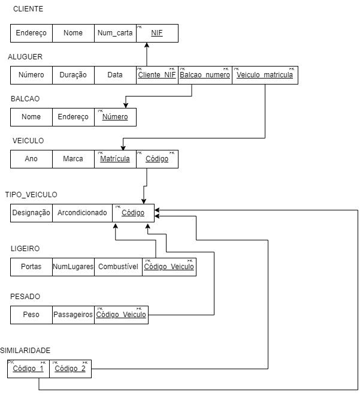
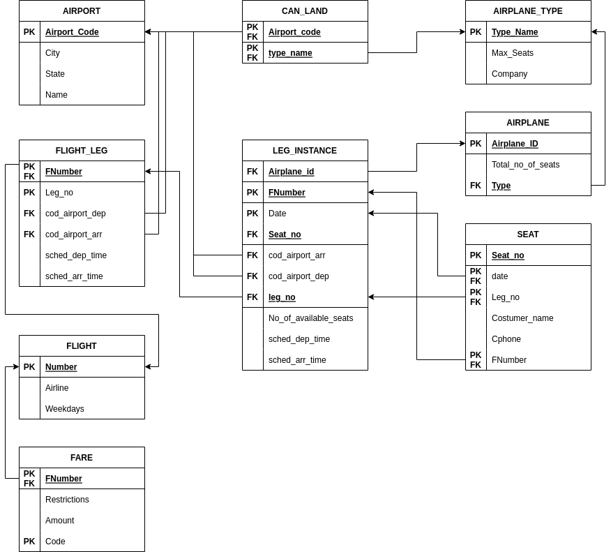
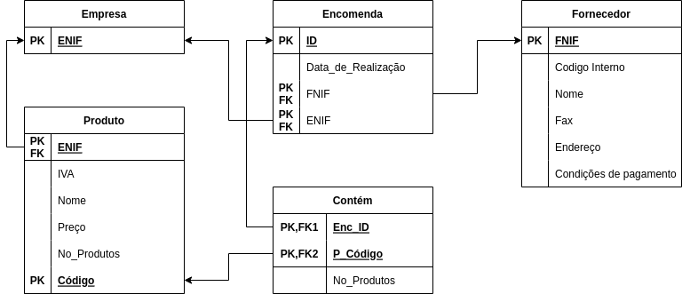
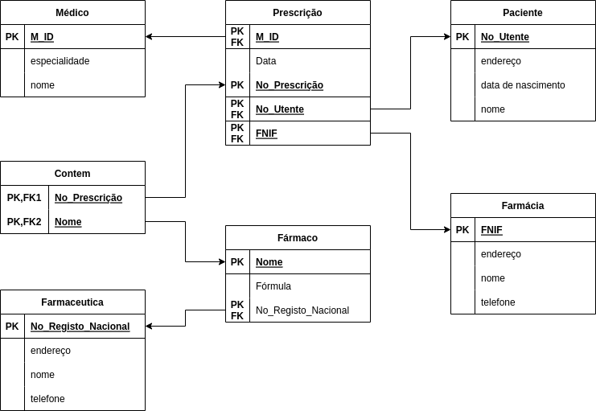
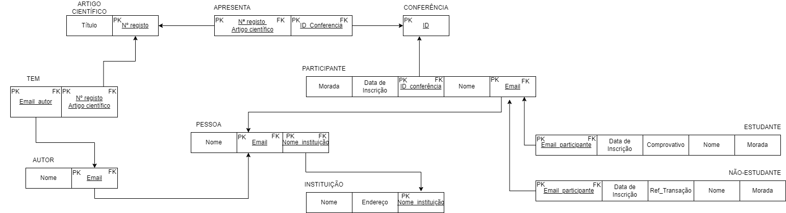
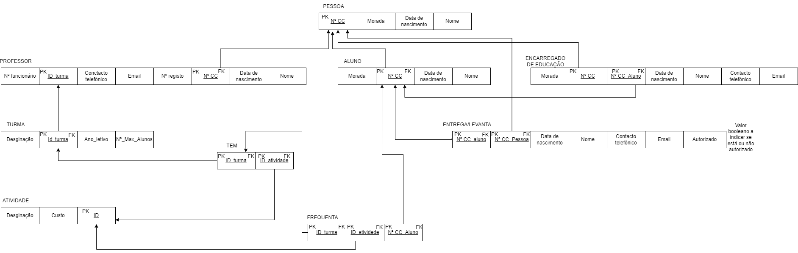

# BD: Guião 3


## ​Problema 3.1
 
### *a)*

```
Cliente: cliente(Nome, Endereço, Num_carta, NIF)
Aluguer: aluguer(Número, Duração, Data)
Balcão: balcao(Nome, Número, Endereço)
Veículo: veiculo(Matrícula, Marca, Ano)
Tipo_veículo: tipo_veiculo(Designação, Arcondicionado, Código)
Similaridade: similaridade(codigo_1, codigo_2)
Pesado: pesado(Peso, Passageiros)
Ligeiro: ligeiro(NumLugares, Portas, Combustivel)

```


### *b)* 

```
| | Cliente | Aluguer | Balcão | Veículo | Tipo_Veiculo | Similaridade | Pesado | Ligeiro |
|---|---|---|---|---|---|---|---|---|
| Chaves candidatas| Num_Carta | Número | Número | Matrícula | código | código_1,código_2 | código | código |
| Chave Principal | NIF | Número | Número | Matrícula | código | código_1,código_2 | código |código |
| Chaves Estrangeiras | | Titular,Local,Objeto | | Tipo | | código_1,código_2 | código | código |

```


### *c)* 




## ​Problema 3.2

### *a)*

```
Airport: airport(Airport_Code, City, State, Name)
Airplane_Type: airplane_type(Type_Name, Max_Seats, Company)
Airplane: airplane(Airplane_Id, Total_No_Of_Seats, Airplane_Type)
Flight_Leg: flight_leg(Leg_no, Flight_number, Airpor_Code_Dep, Airport_Code_Arr, Sch_Dep_Time, Sch_Arr_Time)
Flight: flight(Number, Airline, Weekdays)
Fare: fare(Code, Amount, Restrictions, Flight_Number)
Leg_Instance: leg_instance(Date, No_Of_Avail_Seats, Flight_Number, Airport_Code_Dep, Airport_Code_Arr, Dep_Time, Arr_Time, Airplane)
Seat: seat(Date, Seat_No, Flight_Number, Leg_Number, Costumer_Name, Phone)
Can_Land: can_land(Airplane_Type, Airport
```


### *b)* 

```
| | Airport | Airplane_type | Airplane | Flight_leg | Flight | Fare | Leg_instance | Can_land | Seat |
|---|---|---|---|---|---|---|---|---|---|
| Chaves candidatas| Airport_Code, Name | Type_Name | Airplane_id | Leg_No | Number | Code | Date | Airport_code, type_name | Seat_no, costumer_name|
| Chave Principal | Airport_Code | Type_Name | Airplane_id  | Leg_No |Number | Code | Flight_Number, Leg_No, Date | Airport_code, type_name | Seat_No|
| Chaves Estrangeiras | |  |Airplane_type |Flight_Number,
Leg_number, cod_airport_arr, cod_airport_dep
  | |Flight_Number  | Flight_Number, Leg_No, Airport_Code_Dep. Airport_Code_Arr.
Date
Airplane_id
 | Airport_code, type_name | Flight_Number, Leg_Number, Date, flight_number|
```


### *c)* 




## ​Problema 3.3


### *a)* 2.1



### *b)* 2.2



### *c)* 2.3



### *d)* 2.4


