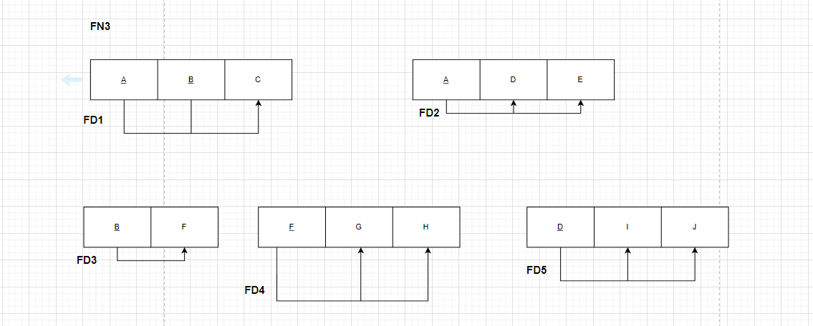
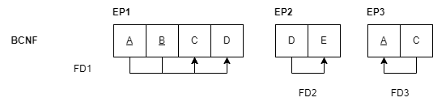

# BD: Guião 7


## ​7.2 
 
### *a)*

```
A relação está na 1ª forma normal, porque a relação apenas apresenta atributos atómicos e não contém relações dentro de relações
```

### *b)* 

```
Para normalizar até à 3FN, temos que remover todas as dependências transitivas e parciais, logo temos as seguintes relações:

R1(_Titulo_livro_, _Nome_autor_, Editor, tipo_livro, NoPaginas, Ano_Publicação);

R2(Tipo_livro, NoPaginas, Preço);

R3(Nome_autor, Afiliação);

R4(Editor, Endereço_Editor);
```


## ​7.3
 
### *a)*

```
A chave será (A, B)
```


### *b)* 

```
Para normalizar até à 2FN, temos que remover a dependências parciais, logo ficamos com as seguintes relações:
R1(A, B, C);
R2(A, D, E, I, J);
R3(B, F, G, H);

```


### *c)* 

```
Para normalizar até à 3FN, temos que remover a dependências parciais e transitivas, logo ficamos com as seguintes relações:
R1(A, B, C);
R2(A, D, E);
R3(B, F);
R4(F, G, H);
R5(D, I, J);

```




## ​7.4
 
### *a)*

```
A chave da relação será A,B.
```


### *b)* 

```
Para normalizar até à 3FN, temos que remover todas as dependências transitivas e parciais, logo temos as seguintes relações:

```


### *c)* 

```
Para normalizar até à BCNF, todos os atributos são funcionalmente dependentes da chave da relação, logo temos as seguintes relações:

```



## ​7.5
 
### *a)*

```
A chave da relação será A,B.
```

### *b)* 

```
Para normalizar até à 2FN, não podem existir dependências parciais, logo temos as seguintes relações:
```


### *c)* 

```
Para normalizar até à 3FN, temos que remover todas as dependências transitivas e parciais, logo temos as seguintes relações:
```


### *d)* 

```
A relação no exercício anterior já estava normalizada, segundo os critérios da BCNF.
```

